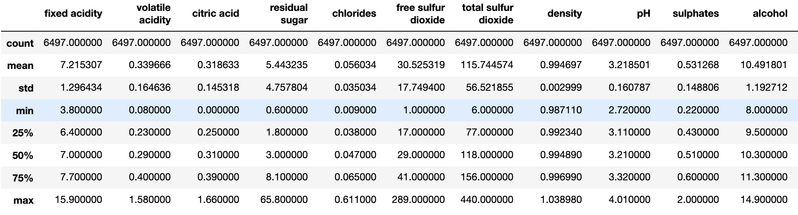
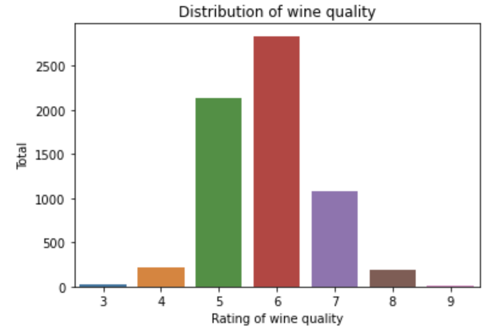
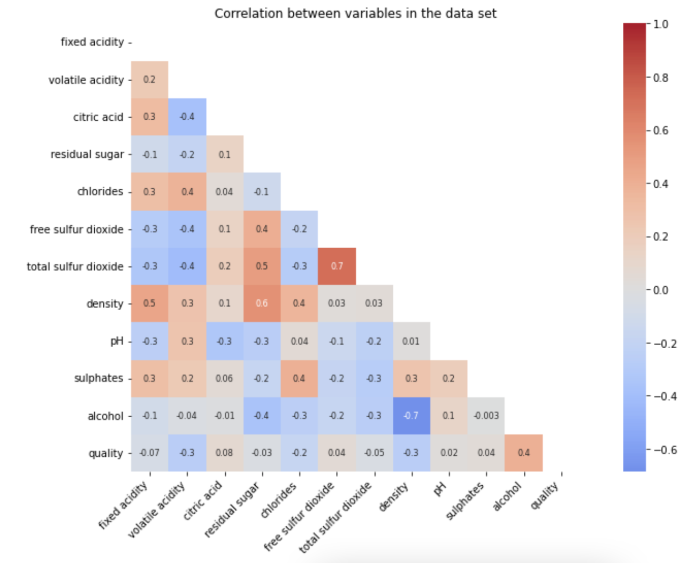
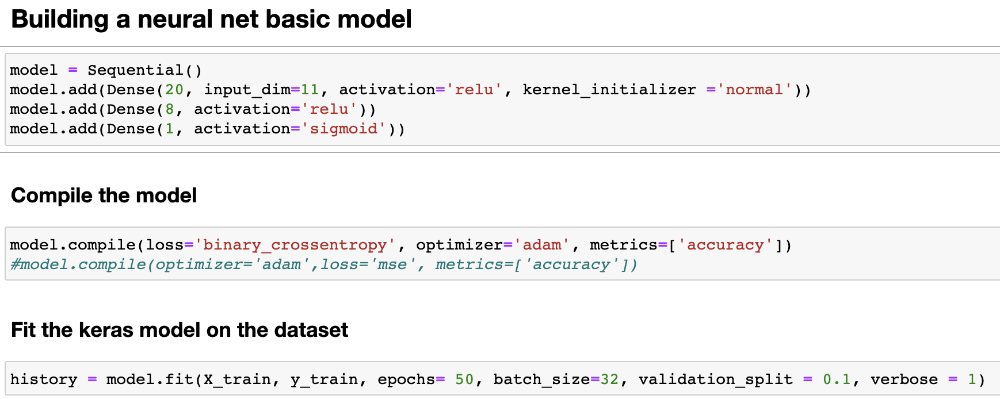
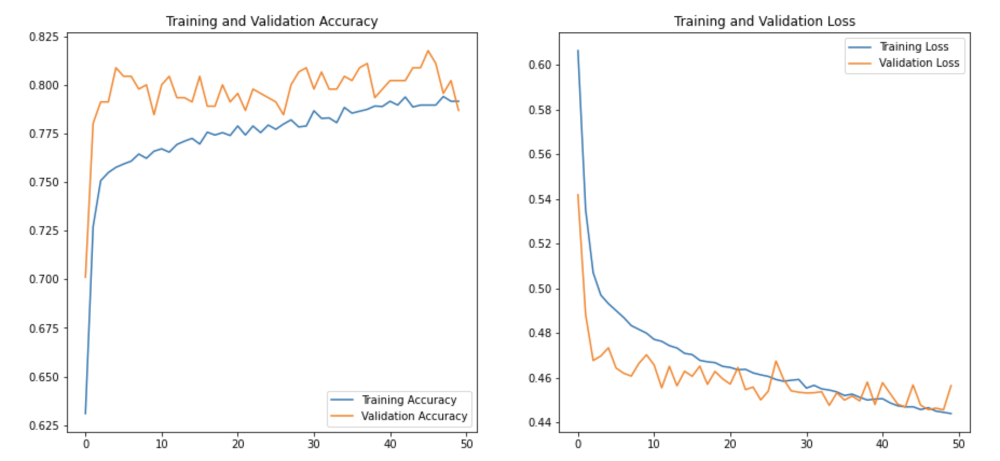
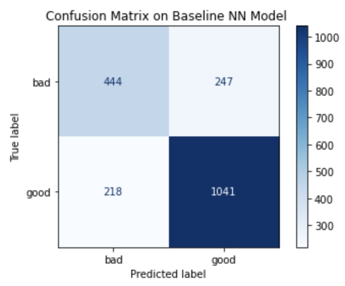

**WINE QUALITY PREDICTION - Building Deep Learning Models in Python With Keras**

This project is about predicting the Wine quality by applying Neural Network - a deep learning technique.

My mission is to create a AI system that can predict the quality of a wine. In order to do that, first, I will get the data provided by customer in the folder "additional_resources/datasets/Wine Quality/wine.csv"

Then, I will explore and clean the data (no missing values). 
After that, I will define the problems as its classification or regression problems.

In machine learning, it is customary to have a baseline model. Thus, the first step of this project is to get a very simple architecture to work with the standard, unmodified data.

## **The steps to build a baseline model using Keras**
1. Load Data.
2. Define Keras Model.
3. Compile Keras Model.
4. Fit Keras Model.
5. Evaluate Keras Model.
6. Tie It All Together.
7. Make Predictions

## 1. Data description:
  + **Features** (input variables):
  
      1 - fixed acidity:    
      2 - volatile acidity       
      3 - citric acid       
      4 - residual sugar       
      5 - chlorides      
      6 - free sulfur dioxide       
      7 - total sulfur dioxide       
      8 - density       
      9 - pH      
      10 - sulphates      
      11 - alcohol
      
  ### **Inferences from the dataset**:

   * The average of **'quality'** is 5.81 
   * **pH** has a high mean of 3.21, max is 4.01
   * **alcohol** has also high mean 10.49

  + **Target** (output variable): 
      quality: score between 0 and 10
      
 
 
The rating of wine quality distribute is mostly at 5, 6, 7. There is an imbalance in data distribution between categories. 
  + **Correlation between variables**
   

+ **Inferences from the heatmap**:
    * High degree of positive correlation between **alcohol** and **quality**. Wines with high alcohol content are perceived as better quality
    * Negative correlation between **quality** and **density**, **volatile acidity**.

## Building a non neural network model

## Building a basic neural network  model

  + 61/61 - 0s 1ms/step - loss: 0.4942 - accuracy: 0.7610
  + 143/143 - 0s 884us/step - loss: 0.4418 - accuracy: 0.7983

