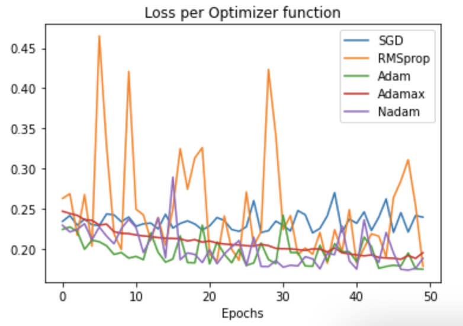

**WINE QUALITY PREDICTION - Building Deep Learning Models in Python With Keras**

## Project aims:
This project is about the wine quality prediction adopting Neural Network model - a deep learning technique. 

The main aim of the project is to create a AI system that can predict the quality of a wine. In order to do that, first, I will get the data provided by customer in the folder "additional_resources/datasets/Wine Quality/wine.csv"; 

Next, I will explore and clean the data. Luckily, the data has been cleaned by the other team. Overall, the main target is to build a neural network model that can predict the quality of wine (i.e. good or bad). Then, improving the model performance by tuning hyperparameters.

## Installation
### Python version
* Python 3.8

### Packages used
* pandas==1.3.2
* scikit-learn==0.24.2
* matplotlib==3.3.3
* tensorflow==2.6.0
* plotly==4.14.1

## **The steps to build a baseline model using Keras**
1. Load Data.
2. Define Keras Model.
3. Compile Keras Model.
4. Fit Keras Model.
5. Evaluate Keras Model.
6. Tie It All Together.
7. Make Predictions

## 1. Data description:
  + **Features** (input variables):
      
     
  
  #### **Inferences from the dataset**:

   * The average of **'quality'** is 5.81 
   * **pH** has a high mean of 3.21, max is 4.01
   * **alcohol** has also high mean 10.49

  + **Target** (output variable): 
      quality: score between 0 and 10
      
 
 
The rating of wine quality distribute is mostly at 5, 6, 7. There is an imbalance in data distribution between categories. 

  ### Target binary convert

| original quality values            | binary quality value         |
|-------------------|----------------------------------------------|
| 1 - 5 | 0 (bad)                         |
| 6 - 9 | 1 (good) | 

   

  + **Correlation between variables**
   

+ **Inferences from the heatmap**:
    * High degree of positive correlation between **alcohol** and **quality**. Wines with high alcohol content are perceived as better quality
    * Negative correlation between **quality** and **density**; **quality** and **volatile acidity**

    * Features have **positive** impact on Wine Quality are: 'fixed_acidity', 'residual_sugar','free_sulfur_dioxide', 'pH', 'sulphates', 'alcohol'
    * Features have **negative** impact on Wine Quality are: 'volatile_acidity', 'citric_acid', 'chlorides', 'total_sulfur_dioxide', 'density'

## Building a basic neural network  model

  + Model evaluation:
 
    - the Test set - loss: 0.4942 - accuracy: 0.7610   
    - the Training set -loss: 0.4418 - accuracy: 0.7983

## Turning Models
  
  + Tune **Optimizer** functions:

  + Tune **Activation** functions:
    * Plot of loss rate and epochs
  
 
 

## Using GridSearchCV on hyperparameters

| Hyperparameter| Value given| Best values|Accuracy rate|
|:---|:---|:---|:---|
|batch size| [10, 20, 40, 60, 80, 100]|80|0.77|
|epochs|[10, 50, 100]|50|0.77|
|optimizer|['SGD', 'RMSprop', 'Adagrad', 'Adadelta', 'Adam', 'Adamax', 'Nadam']|RMSprop|0.764|
|learning_rate|[0.001, 0.01, 0.1, 0.2, 0.3]|0.001|0.769|
|momentum|[0.0, 0.2, 0.4, 0.6, 0.8, 0.9]|0.9|0.769|
|activation|['softmax', 'softplus', 'softsign', 'relu', 'tanh', 'sigmoid', 'linear']|tanh|0.77|
|weight_constraint|[1, 2, 3, 4, 5]|5|0.765|
|dropout_rate|[0.0, 0.1, 0.2, 0.3, 0.4, 0.5, 0.6, 0.7, 0.8, 0.9]|0.1|0.765|
|neurons|[1, 5, 10, 15, 20, 22, 25, 30]|30|0.755|

### Root folder
| File            | Description                                                 |
|-------------------|-------------------------------------------------------------|
| assets/| Directory containing graphics                        |
| DL-wine-quality.ipynb | Python notebook containing functions for dataset manipulation, building base model|
| GridSearch_HyperParameters.ipynb | Python notebook containing functions for Gridsearch | 

# Contributor
| Name                   | Github                              |
|------------------------|-------------------------------------|
| Minh Hien Vo | https://github.com/minhhienvo368  |

# Timeline
07/09/2021 - 09/09/2021
